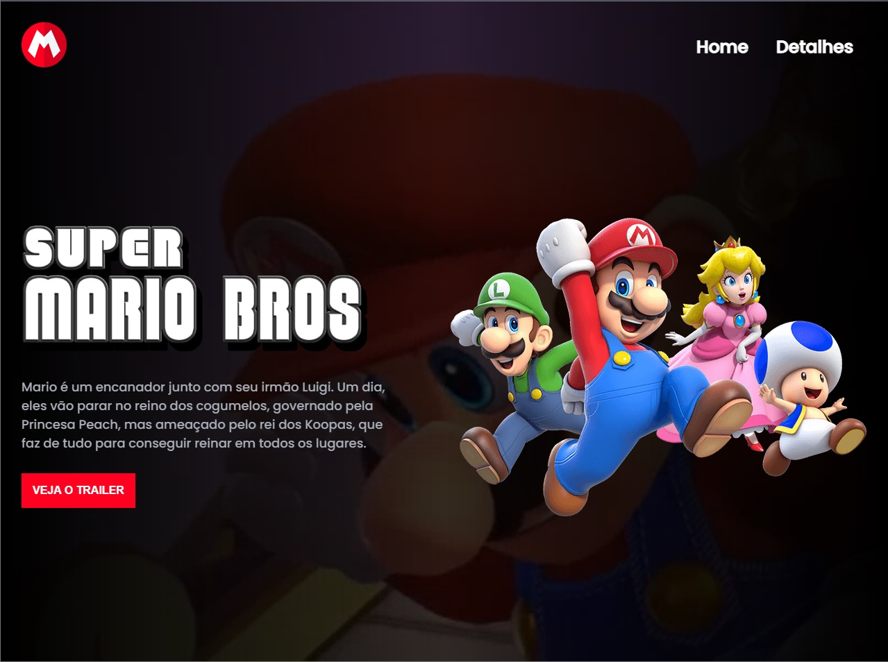

<h1 align="center"> Super Mario Bros </h1>

Projeto criado pelo canal Dev em Dobro para divulgar seu curso, focado em técnicas de HTML, CSS e JS  

  <a href="#-tecnologias">Tecnologias</a>&nbsp;&nbsp;&nbsp;|&nbsp;&nbsp;&nbsp;
  <a href="#-projeto">Projeto</a>&nbsp;&nbsp;&nbsp;|&nbsp;&nbsp;&nbsp;
  <a href="#-layout">Layout</a>&nbsp;&nbsp;&nbsp;|&nbsp;&nbsp;&nbsp;
  <a href="#memo-licença">Licença</a>

 

  

## 🚀 Tecnologias

Esse projeto foi desenvolvido com as seguintes tecnologias:

- HTML e CSS
- JavaScript
- Git e Github

## 💻 Projeto

Super Mario Bros é um projeto inspirado no filme que será lançado, baseado nos jogos da Nintendo

---

Feito com ♥ by Dev em Dobro :wave: [Participe da nossa comunidade!](https://discord.com/invite/p4u9sqWyXz)